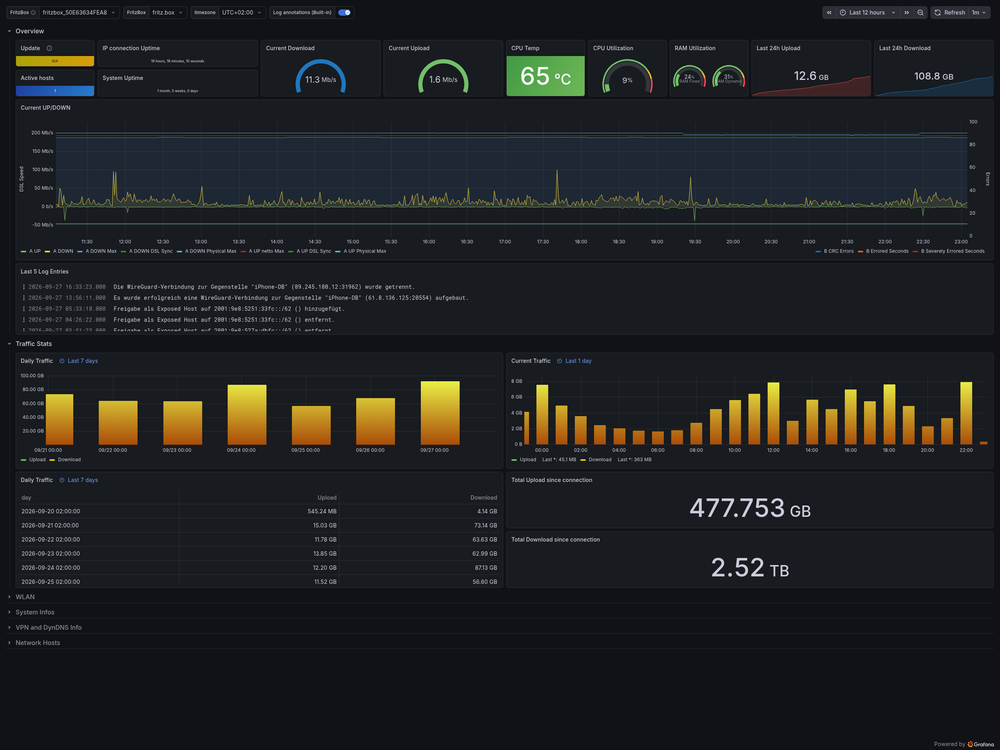

<p align="center">
  
</p>

<h1 align="center">fritzFluxDB</h1>

<p align="center">
  Lightweight daemon that collects metrics from your FRITZ!Box and pushes them into InfluxDB or QuestDB.
</p>

<p align="center">
  <a href="https://github.com/Gill-Bates/fritzfluxdb/releases">
    
  </a>
  <a href="https://github.com/Gill-Bates/fritzfluxdb/actions/workflows/docker-build.yml">
    
  </a>
  <a href="https://hub.docker.com/r/giiibates/fritzfluxdb">
    
  </a>
  <a href="https://github.com/Gill-Bates/fritzfluxdb/blob/main/LICENSE">
    
  </a>
</p>

<p align="center">
  📖 <a href="https://gill-bates.github.io/fritzfluxdb/"><strong>Full documentation</strong></a>
</p>

> [!NOTE]
> **Built on the shoulders of giants.** This project is a fork of and would not exist without
> [**bb-Ricardo/fritzinfluxdb**](https://github.com/bb-Ricardo/fritzinfluxdb) by **Ricardo Bartels**.
> The original laid the entire foundation for collecting FritzBox metrics into InfluxDB —
> a huge thank you for the years of work behind it. 🙏

## ✨ Why fritzFluxDB?

- **Prefers QuestDB** — fritzFluxDB prefers QuestDB, and QuestDB is the author's recommended
  storage backend. InfluxDB v1 and v2 remain fully supported.
- **Three storage backends** — InfluxDB v1, InfluxDB v2, and QuestDB, with optional server-side
  downsampling on QuestDB so long-term history doesn't cost full-resolution storage forever.
- **Sees more of your box** — TR-064 and Lua service data, home automation devices, call logs,
  VPN, network hosts, and system stats, all in one daemon.
- **Built for containers** — a small multi-arch (`amd64`/`arm64`) image, non-root, Tini as PID 1,
  with a watchdog and graceful shutdown that flushes buffered measurements instead of dropping them.
- **Ready-made Grafana dashboards** — system, call log, router log, and home automation dashboards
  ship in the repository for every supported backend.

<p align="center">
  
</p>

## 🔀 Why this fork?

This fork modernises the original codebase around **operational reliability**, a **smaller,
container-first footprint**, and **QuestDB** as a third storage backend. It runs on Python 3.13,
writes database data through a single lightweight `httpx` client rather than dedicated InfluxDB
clients, buffers and flushes measurements on shutdown, and backs off exponentially on HTTP errors
instead of retrying at a fixed interval.

See the [full comparison](https://gill-bates.github.io/fritzfluxdb/development/fork-comparison/)
in the documentation, including what the original still does that this fork intentionally
dropped.

## 🚀 Quick Start

```bash
test -e .env || cat .env.example .env.questdb.example > .env
# edit .env with your FRITZ!Box settings
docker compose -f docker/docker-compose.questdb.yml up -d
```

The Compose file starts QuestDB (recommended) together with fritzfluxdb and connects them
automatically. To use InfluxDB instead, build `.env` from `.env.example` plus `.env.influxdb.example` and start
`docker/docker-compose.influx2.yml` (or `docker-compose.influx1.yml`); those files start fritzfluxdb
only, so an existing InfluxDB endpoint must be reachable from the container and credential
transmission over plaintext is disabled by default. For a local Python run instead, see
**[Installation](https://gill-bates.github.io/fritzfluxdb/getting-started/installation/)** and
**[Docker Compose](https://gill-bates.github.io/fritzfluxdb/getting-started/docker/)**.

## 📚 Documentation

Configuration reference, QuestDB downsampling, the polling model, Grafana dashboard setup, and the
architecture all live in the docs site — this README stays short on purpose.

- [Installation](https://gill-bates.github.io/fritzfluxdb/getting-started/installation/)
- [Environment variables](https://gill-bates.github.io/fritzfluxdb/configuration/environment/)
- [Storage backends](https://gill-bates.github.io/fritzfluxdb/storage/overview/) (InfluxDB, QuestDB, downsampling)
- [Grafana dashboards](https://gill-bates.github.io/fritzfluxdb/monitoring/grafana/)
- [Local development](https://gill-bates.github.io/fritzfluxdb/development/setup/)
- [Changelog](CHANGELOG.md)

## 📄 License

[MIT](LICENSE) — © 2026 Gill-Bates

---

> **Disclaimer:** This project is an independent open-source tool and is not affiliated with, endorsed by, or in any way associated with FRITZ.com GmbH, Alt-Moabit 95, 10559 Berlin, or the FRITZ!Box product line. FRITZ!Box is a registered trademark of FRITZ.com GmbH.

<p align="center">
  <a href="https://www.buymeacoffee.com/tnsteinerx">
    
  </a>
</p>
