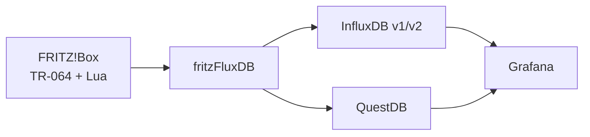

# fritzFluxDB

<p align="center">
  
</p>

fritzFluxDB is a lightweight, container-friendly daemon that collects metrics from a
FRITZ!Box and writes them to InfluxDB v1, InfluxDB v2, or QuestDB. It also exposes call logs,
router logs, VPN data, network hosts, connection information, system statistics, and supported
smart-home metrics to the selected time-series backend.

## Start here

The recommended deployment is Docker Compose with an existing database. The repository's InfluxDB
Compose examples start only the application; its QuestDB example also starts QuestDB:

```bash
test -e .env || cat .env.example .env.influxdb.example > .env
# Edit .env with your FRITZ!Box values and a reachable InfluxDB endpoint.
# Use HTTPS, or explicitly allow HTTP credentials on a trusted network.
docker compose -f docker/docker-compose.influx2.yml up -d
```

The InfluxDB server must already be running and reachable from the container. For all deployment
options, see [Docker Compose](getting-started/docker.md). For the first configuration decision,
read [Backend overview](storage/overview.md).

!!! warning "Credentials stay local"
    The examples in this documentation use placeholders only. Keep `.env`, tokens, passwords,
    and exported database credentials outside Git and never paste them into issue reports.

## What the daemon does



The daemon polls the FRITZ!Box asynchronously, buffers measurements, and flushes buffered data
before a graceful shutdown when possible. The Docker image runs as a non-root user and uses Tini
plus a watchdog entrypoint.

## Documentation map

- [Installation](getting-started/installation.md) — prerequisites and deployment choices.
- [Environment variables](configuration/environment.md) — complete runtime configuration.
- [Polling and data model](configuration/data-model.md) — collection cadence and measurement naming.
- [InfluxDB](storage/influxdb.md) and [QuestDB](storage/questdb.md) — backend-specific setup.
- [Grafana dashboards](monitoring/grafana.md) — import and datasource requirements.
- [Architecture](development/architecture.md) — code layout and runtime flow.

Current release metadata is in `pyproject.toml`; see the [changelog](changelog.md) for the
latest released version and its notes.
The project is independent open source software and is not affiliated with FRITZ.com GmbH, Alt-Moabit 95, 10559 Berlin.
